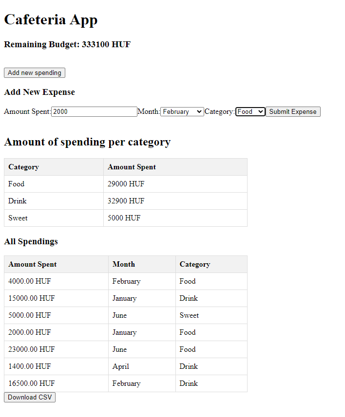

## Technologies Used
- Laravel Sail: Laravel Sail is a lightweight command-line tool for managing Laravel applications within Docker containers. It simplifies the development environment setup.
- Laravel: Laravel is a popular PHP framework known for its elegant syntax and developer-friendly features.
- Vue.js: Vue.js is a progressive JavaScript framework for building user interfaces. It's used for the frontend of this project to create dynamic and interactive components.
- MySQL: The project uses MySQL as the database to store user data, posts, likes, and comments.

<hr>
  <p align="center">
     
 </p>
 <hr>

### Pre-requisites
Make sure you have Docker installed on your system.

Installation
Clone the repository:

```bash
git clone https://github.com/boringAdam/Cafeteria-App
```

Navigate to the project directory:

```bash
cd cafeteria-app
```

Copy the .env.example file to .env:

```bash
cp .env.example .env
```

In case of new enviroment:

```bash
sudo apt update
sudo apt install composer
```

If the php version is not satisfying

```bash
sudo apt install php8.1-xml php8.1-dom php8.1-curl
```

When testing in a brand new environment I also needed these to get a few necessary packages.

```bash
sudo apt-get update
sudo apt-get upgrade
sudo add-apt-repository ppa:ondrej/php
```

With a new WSL Ubuntu I had issues with installing the laravel/sail these commands solved the problem

```bash
sudo rm -rf vendor
sudo rm composer.lock
sudo composer clear-cache
```

Installing laravel/sail and mysql if it's not already installed
```bash
composer require laravel/sail --dev
sudo apt install mysql-client-core-8.0
```

Start the Docker containers using Laravel Sail, run the database migrations and seed the database:

```bash
./vendor/bin/sail up -d
./vendor/bin/sail artisan migrate
./vendor/bin/sail artisan db:seed
```

Install the frontend dependencies and build the assets:

```bash
npm install
npm run dev
```

The Cafeteria App should now be accessible at http://localhost
The database is accessible with phpmyadmin configuration at http://localhost:8001
DB_USERNAME=sail
DB_PASSWORD=password

## License

The Laravel framework is open-sourced software licensed under the [MIT license](https://opensource.org/licenses/MIT).
